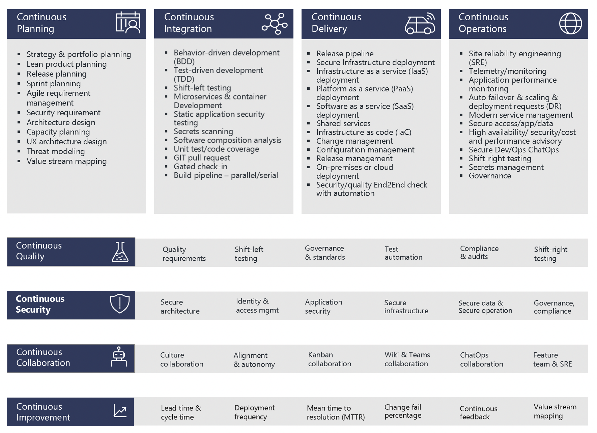

From a 'Best-Practice' point of view , this section of the site is structured something similar to Microsofts FOUR pillars of DevOps:

Below you can learn more about each particular DevOps best practice.

- [Continuous Planning](continuous-planning/planning-overview.md)

  - [Agile Development](continuous-planning/agile-development/agile-overview.md)
  - Design Reviews - TBC

- Continuous Integration
- Continuous Delivery
- Continuous Quality
- Continuous Security
- Continuous Operations
- Continuous Collaboration
- Continuous Improvement

<!---  Example of Image with caption
#<figure markdown>
#  { width="300" }
#  <figcaption>Image caption</figcaption>
</figure>
 --->
