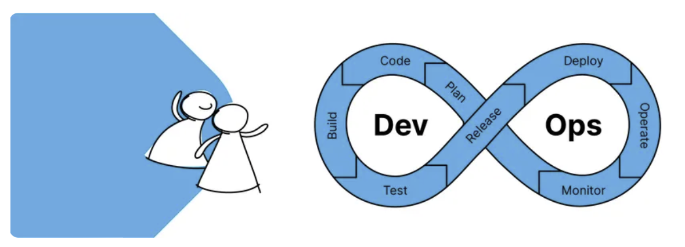
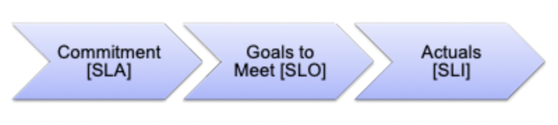

# DevOps Vs SRE

_This article originated from a blog on [Harness's website](https://harness.io/blog/devops/sre-vs-devops/) - dated Nov 3, 2021_

## Overview

In a nutshell, DevOps Engineers are ops-focused engineers who solve development pipeline problems. Site Reliability Engineers are development-focused engineers who solve operational/scale/reliability problems.

  { width="300" }

Software is certainly eating the world, and as our dependence on technology increases, disciplines have arisen to ensure that changes are rolled out efficiently and our systems are there when we need them. The rise of DevOps and Site Reliability Engineering cultures and practices has risen to the mainstream over the past years.  

Being a DevOps Engineer or SRE are certainly in-demand job titles and skillsets to have. Not to fall into the eponym of “CI/CD” while saying “DevOps/SRE,” understanding the overlap and differences between the two skillsets and organizations is important. Both solve very distinct challenges with unique and innovative approaches, ushering in new paradigms in technology.

## What Are the Differences Between SREs and DevOps?

Having more efficient and reliable systems are not new goals in technology. Like many other facets of technology, the learnings and science behind both goals have increased to warrant specialized organizations and engineers.  

The DevOps movement is all about breaking down silos. The quintessential disconnect of the development team and operations team is exactly what DevOps Engineers and leaders are trying to solve. This divide makes sense, as those who write software were typically not those who run the software. Years of these practices take time to untangle in organizations and changing mindsets are hard to forecast.

Having reliable systems at scale is a complex problem to solve. As systems become more distributed in nature, ensuring reliability or the appearance of reliability across the vast topology of moving parts is challenging. Internal and external customers alike expect systems to be available all the time, and even a brief outage (downtime) or reduction in uptime can be detrimental to a firm’s reputation and bottom line.

In a nutshell, DevOps Engineers are ops-focused engineers who solve development pipeline problems. Site Reliability Engineers are development-focused engineers who solve operational/scale/reliability problems. Both sets of engineers are crossing the chasm by bringing their expertise and opinions to the other side of the equation. Though, we are human and fallible, and subject to Conway’s Law.

## Conway’s Law At Play

A popular organizational item to talk about in DevOps culture is [Conway’s Law](https://en.wikipedia.org/wiki/Conway%27s_law). If you are unfamiliar with Conway’s Law, it is an adage stating that organizations design systems which mirror their own communication structure. We are people, and us as people, design systems. Looking at DevOps team structures, DevOps teams are focused on breaking down organizational silos that were created by Conway’s Law and creating a cultural shift toward collaboration and communication. These silos that are institutional are barriers in engineering efficiency; two or more sets of people to get features across the line and be operational with separate goals. Reading one of the quintessential DevOps pieces, [Gene Kim’s The Phoenix Project](https://www.amazon.co.uk/Phoenix-Project-Devops-Helping-Business/dp/1942788290/ref=tmm_pap_swatch_0?_encoding=UTF8&qid=1658840934&sr=8-1), illustrates how problems can be tossed across the proverbial wall.

The adage that reliability is everyone’s responsibility is true, but the core of innovation work is that we are trying things for the first time. Where DevOps focuses more on the merging and removal of the silos, Site Reliability Engineering focuses on the craft of reliability. Reading one of the quintessential SRE pieces, [Google’s SRE Book](https://sre.google/sre-book/table-of-contents/), there is more of a focus on approach and respecting the complexity for operating systems at scale.

Because we are all still fighting Conway’s Law, having a solid DevOps team does not mean you have site reliability down. The vice versa is true: just because you have site reliability down doesn’t mean that you have engineering efficiency that a DevOps investment brings. They are solving for two different domains.

## Two Different Problem Sets

Engineering efficiency and reliability are two separate domains, but have some overlap. There is a correlation between agility and more robust systems. A counter-argument might be made that agility brings about a fast velocity of change, and change is a detriment to reliability. Today’s challenges are faced at scale, and as we continue to push the boundaries, adjusting on-the-fly is important. The problems that both teams solve are telling to the culture and skills needed for both to thrive.

## What Problems Do DevOps Teams Solve?

Engineering efficiency can have a wide paintbrush. If you take a look at certain DevOps job postings, **it can sound like the job poster is looking for an entire IT organization in one person**. The SDLC (software delivery life cycle) can be a windy road to traverse. DevOps teams strive to remove bottlenecks across the entire SDLC by removing barriers to production and automation. With the adoption of Agile, production changes are being created and needing to be deployed at a faster velocity, as incremental changes are now the expectation.

The DevOps teams are purveyors of development tools, from providing guidance at the inception of the SDLC with source code management (SCM) recommendations to enabling Continuous Integration and Continuous Delivery in an organization. With a wide gamut of responsibilities, DevOps teams can have ownership and oversight over a number of tools and platforms. SREs, on the other hand, focus on system health. Lastly, it’s important to note the [DevOps pillars](https://docs.microsoft.com/en-us/learn/modules/introduce-foundation-pillars-devops/) as these can offer more detail into what DevOps teams solve for.

## What Problems Do SREs Solve?

Site Reliability Engineering teams focus on safety, health, uptime, and the ability to remedy unforeseen problems. A romanticized idea is that SREs are only sprung into action during an incident, helping devise remedies for problems until the engineering teams can make proper remediation. Certainly, an important pillar of the job is combating incidents, and SREs spend a good deal of time making sure the firefight doesn’t occur with their vast expertise.

By removing some of the complex burdens in how to scale and maintain uptime in distributed systems, SRE practices allow development teams to focus on feature development instead of the nuances of achieving and maintaining service level commitments.  

## SLAs, SLOs, and SLIs

Both DevOps and SRE teams value metrics, as you can’t improve on what you can’t measure. Indicators and measurements of how well a system is performing can be represented by one of the Service Level (SLx) commitments. There is a trio of metrics, SLAs, SLOs, and SLIs, that paint a picture of the agreement made vs the objectives and actuals to meet the agreement. With SLOs and SLIs, you can garner insight into the health of a system.

### SLAs

Service Level Agreements are the commitment/agreement you make with your customers. Your customers might be internal, external, or another system. SLAs are usually crafted around customer expectations or system expectations. SLAs have been around for some time, and most engineers would consider an SLA to be “we need to reply in 2000ms or less,” which in today’s nomenclature would actually be an SLO. An SLA, in that case, would be “we require 99% uptime.”

### SLOs

Service Level Objectives are goals that need to be met in order to meet SLAs. Looking at Tom Wilkie’s RED method can help you come up with good metrics for SLOs: requests, errors, and duration. In the above example of “we need to reply in 2000ms or less 99% of the time,” that would fall under duration, or the amount of time it takes to complete a request in your system. Google’s Four Golden Signals are also great metrics to have as SLOs, but also includes saturation. Measuring SLOs is the purpose of SLIs.

### SLIs

Service Level Indicators measure compliance/conformance with an SLO. Harping on the “we need to reply in 2000ms or less 99% of the time” SLO from above, the SLI would be the actual measurement. Maybe 98% of requests have a reply in less than 2000ms, which is not up to the goal of the SLO. If SLOs/SLIs are being broken, time should be spent to remedy/fix issues related to the slowdowns

For DevOps teams, system health and availability does not mean engineering efficiency is being met. Another set of metrics to look at for DevOps teams are the Accelerate metrics.

## Accelerate Metrics for DevOps Teams

You can have the most resilient and robust system in the world, but if your customers are not completing their journeys, adoption and success will be hard to attain. In [Accelerate](https://itrevolution.com/book/accelerate/), a book by Nicole Forsgren, Jez Humble, and Gene Kim, we dig into the organizational science of high-performing technology teams.

The authors recommended measuring software delivery performance into four key metrics. Lead Time, Deployment Frequency, Mean Time to Restore (MTTR), and Change Failure Percentage.

### Lead Time

In lean manufacturing, the lead time is the amount of time it takes from a customer request to the fulfillment of that request. In the technology domain, this can be the time from when code is checked in to when the code is deployed into production.

### Deployment Frequency

The number of times that deployments to production occur in an amount of time. Are you deploying to production every day, week, month, year? The more frequently your internal customers can deploy, certainly the more efficient the software delivery process is.

### Mean Time To Restore

Taking another page from lean manufacturing, MTTR is an incident metric that calculates an average time to restore a system. In the software sense, restoring is rolling back to the last known version of the application. Mean Time to Repair is when the repairing starts, e.g the start of the rollback. The “restore” portion of Mean Time to Restore is when the system is back to its previous functionality.

### Change Failure Percentage

This represents the percentage of changes in production that fail. After navigating all of the confidence-building exercises leading up to production, with the number of unknowns in production, a change will fail. Lowering the change failure rate allows for more confidence in production. In modern delivery methods, failing more often early (in a lower environment) is key vs failing in production.

Harness has the ability out of the box to visualize Accelerate metrics, allowing for this data to be shared, thus enabling collaboration across the enterprise.

When comparing concerns of DevOps teams vs SRE teams, we can see where the overlap and differences appear further.

DevOps vs SRE Concern Table

Comparing different DevOps concerns vs SRE concerns.

| Concern                                          | DevOps                                                                                                                           | SRE                                                                                                                                                                                     |
|--------------------------------------------------|----------------------------------------------------------------------------------------------------------------------------------|-----------------------------------------------------------------------------------------------------------------------------------------------------------------------------------------|
| When asked 'What Do You Do Around Here?" | Mange the Development pipeline                                                                                                  | Resilience, scaling, uptime, robustness                                                                                                                                                 |
| TL;DR                                            | A System engineer, who primarily focuses on development problems.                                                                | A Software engineer, focusing on operational problems.                                                                                                                                  |
| Does the Application Cluster?                    | Yes, the application does. We need three nodes.                                                                                  | We use a RAFT-based leader-elected clustering mechanism focused on Apache Zookeeper. We front the application with Apache Mesos to work through Dominant Resource Fairness constraints. |
| Can We Have Monitoring?                          | Yes, we use Prometheus, ELK, and FluentD and can provide hooks into each.                                                        | Concerned about the science around how the monitoring tool works. Black box vs white box monitoring and specific metrics about each. Advising teams on pros/cons.                       |
| Our Deployment Failed.                           | The pipelines we created allow you to re-run. If additional debugging is needed, we can connect the dots with log/trace systems. | Unless it caused an outage, we wouldn’t get involved to help with the remedy. If the deployment regularly fails, we can work to help decipher why.                                      |
| Typical Metrics                                  | Deployment frequency, deployment failure rate.                                                                                   | Error budgets, SLOs, SLIs, Four Golden Signals                                                                                                                                          |
| War Chant                                        | “People, Process, Technology & Automation!”                                                                                      | “There is no root cause!”                                                                                                                                                               |

The level of detail that SREs take a look at are more tool-agnostic and approach-centric vs DevOps teams providing tools and pipelines for engineering organizations to further the mission. Both skillsets and teams are certainly important in any modern organization.

## SRE and DevOps, Better Together

Both can be viewed as leveraged resources; clearly, there is not a 1:1 ratio of a Software Engineer to DevOps Engineers (though it can feel like it as organizations try to scale) or Site Reliability Engineers. O’Reilly’s Building Secure and Reliable Systems, when compared to the first rendition of Google’s SRE Book, discusses team structure poisoning SREs as advisors/experts.

Building software at scale requires specialized engineers to help tackle problems and further capabilities. DevOps Engineers, SREs, and other engineers such as Application Security Engineers fall into the category of specialized advisors. Google, in its SRE Book, described all the expertise across multiple domains needed to launch and maintain a product like Gmail, which surprised even me. Harness is here to enable and partner with engineering organizations. The Harness Platform is well-positioned to help further the mission of your DevOps and SRE teams.
