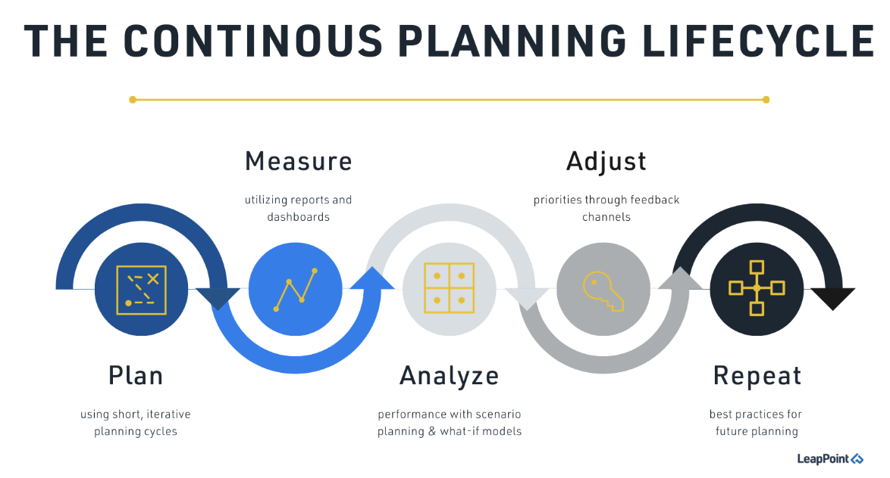
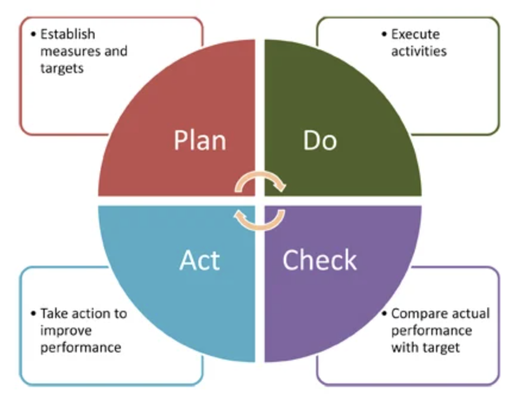

# What is Continuous Planning

Traditional development teams used to plan all their features up front (aka Waterfall style), or in some cases for the entire year ahead. A big bang release would follow months of design, development and if you are lucky testing.

The problem with such long term plans are that they tend to become obsolete very quickly. They also delay any return of investment to when the application or service will be released. Also requirements are rarely clear at the start of a project and late feedback can cause a lot of money to be wasted.

Continuous planning advocates for more flexibility on the scope of the deliverable, trying to keep the cost of projects fixed and providing a faster return of investment by shipping high-value features in iterations first. At the heart of all continuous improvement is the Deming's Plan-Do-Check-Act cycle.

the key steps in this cycle are:

- **Plan** – determine the critical success factors for the process you are trying to improve, establish measurements that will assess your performance in these key result areas, and establish targets against which actual performance will be compared.
- **Do** – execute the process which you are measuring and capture the data which allows you to assess the performance of that process
- **Check** – compare actual performance with the target previously established and understand the reasons for variances
- **Act** – implement the actions necessary to make improvements

This feeds the different phases of development and operations. Also addressing changes and evolutions according to a continuous improvement process, based on continuous feedback. It’s also important that Business and Management teams get the appropriatetraining on tools and metrics in order to have enough visibility of the project’s development.

Continuous Planning will enable your team to provide a constant flow of functionalities by having a continuously updated plan in place, adjusted to the business requirements. Continuous Integration will implement the plan and provide feedback on development speed to ensure a realistic plan is in place.

Continuous Planning is a practice that requires planners, architects, and agile devoplement teams to integrate their plans across the enterprise on an ongoing basis. It relies on six principles:

* Value simplicity
* The manifesto for agile software development
* Design thinking
* Iterative and incremental development
* Lean management
* Estimation accuracy
